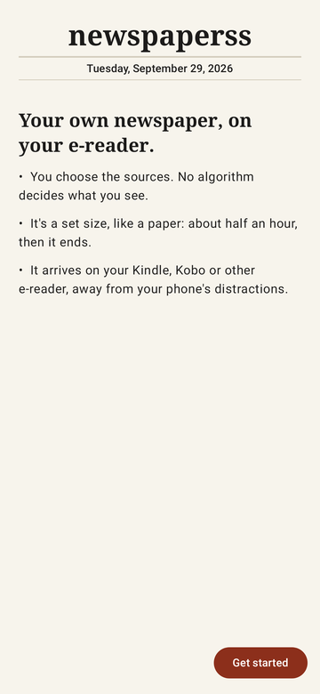
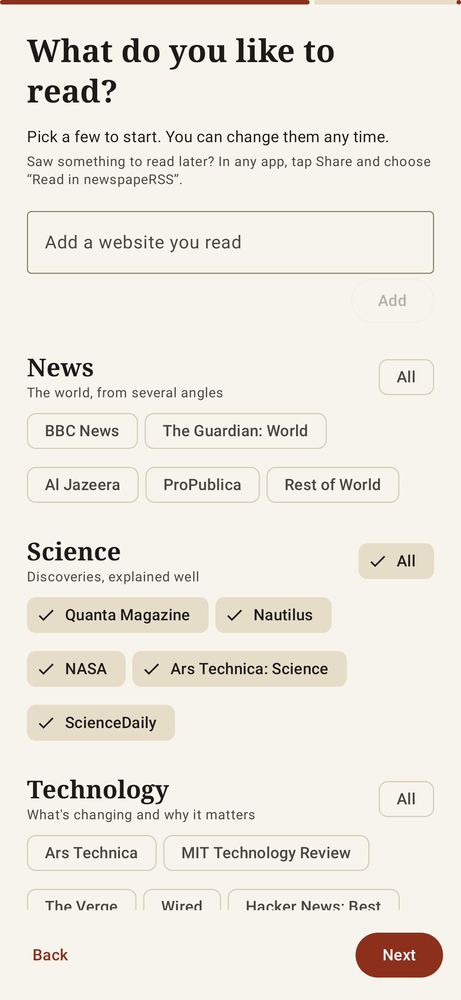
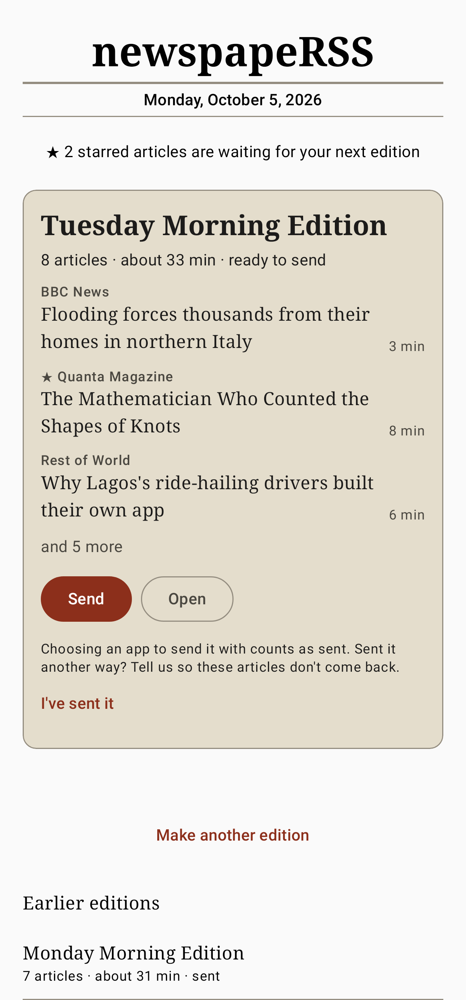
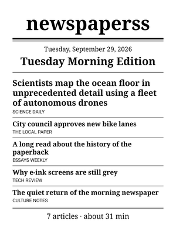
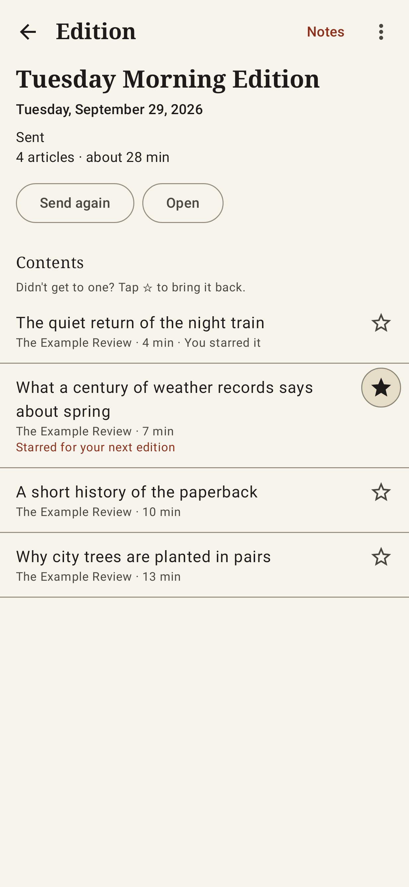
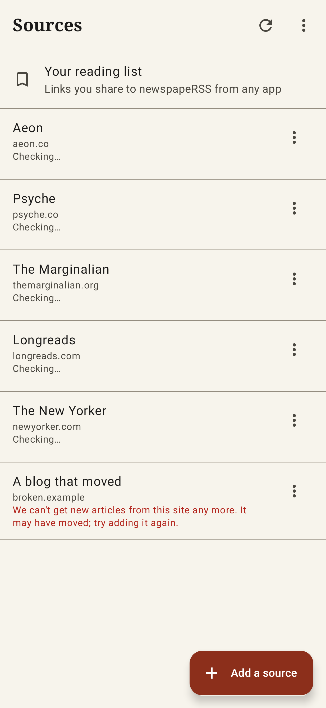
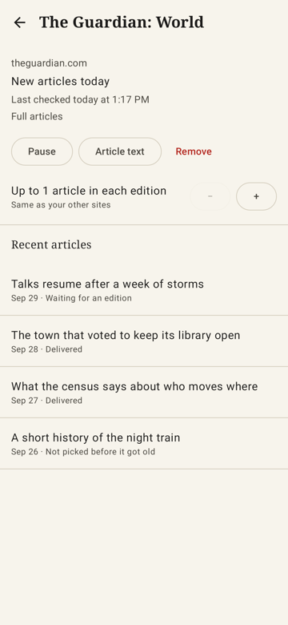
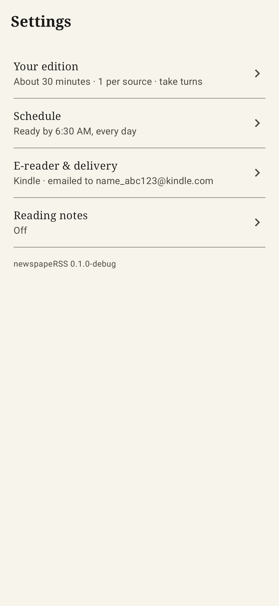

# newspapeRSS

Your own newspaper, on your e-reader.

newspapeRSS turns the sites and links you choose into a finite edition
(say, *about 30 minutes, every morning at 6:30*) and delivers it as a clean
EPUB to your Kindle, Kobo, Boox, PocketBook or KOReader device. No
algorithm, no account, no endless feed: it arrives, it ends, you're done.

It's the app version of
[rss-to-e-reader](https://github.com/madCode/rss-to-e-reader), for people
who'd rather not set up Python, a server and a scheduler.

  
  
  
  

## What it does

- **Pick what you read.** Starter packs of well-known sites, paste any
  website (the app finds its feed), import OPML from another reader, or
  connect a Tiny Tiny RSS account.
- **Save things to read later.** Share a link from any app to "Read in
  newspapeRSS"; import your Pocket or Instapaper export. Add curated lists
  like Arts & Letters Daily, which picks a few links a day.
- **A paper that ends.** Each edition fills a reading-time budget, taking
  turns between sites with at most one article from each (you can allow
  more), so no site drowns out the others. The full article is fetched and
  cleaned for e-ink when a site only sends summaries; the app works out
  which sites need that.
- **Ready when you are.** Set a "ready by" time; the app starts early so the
  paper is there when you wake.
- **A proper book.** A cover with the day's headlines, contents with reading
  times, bylines and a link to each original, images and comics sized for
  e-ink, each article tagged with its language, and an end page with a question to
  think about. Preview any
  article in the app as your e-reader will show it.
- **Delivered your way.** Emailed straight to your Kindle (Send opens
  your mail app with everything filled in), a notification with a Send
  button (Kindle app, Dropbox for a Kobo, email), a synced folder
  (KOReader), or Open on a Boox. Articles are used up only once the
  edition is delivered: saved to your folder, sent through an app you pick,
  or opened on a Boox. If one never arrives, mark it as not sent and its
  articles go back.
- **Star what you want next.** Star an article in a source's list, or one
  from an edition you didn't finish, and it goes first into the next
  edition. Mark the rest as read. Each article says where it stands:
  waiting (and for how many more days), in Thursday's edition, sent
  Wednesday, read, or not picked. With tt-rss, read and unread stay in
  step both ways.
- **Take notes.** A Markdown notes file per edition for Obsidian, Logseq or
  any notes app: properties Obsidian understands, the end page's question, a
  few reflection prompts, and a citation and room for notes under each
  article. Pick a folder (your vault) and each delivered edition's notes are
  saved there, however you send the edition.
- **Calm by design.** No unread counts, no infinite timeline, no
  animations to smear on an e-ink screen.

  
  
  
  

**Status:** early development, not yet released.

## Documentation

- [How it works](docs/DESIGN.md): the edition, delivery, what happens to articles, the architecture.
- [Architecture](docs/ARCHITECTURE.md): how the code is built, with diagrams.
- [Backlog](docs/BACKLOG.md): what's next, grouped by part of the app, and ideas not yet planned.
- [Devlog](docs/DEVLOG.md): what changed each work cycle, and why.
- Research: [persona audits](docs/research/personas.md) and
  [competitors](docs/research/competitors.md).

## Trying it

The newest debug build is always at
[newspapeRSS-debug.apk](https://github.com/madCode/newspaperss/releases/download/latest-debug/newspapeRSS-debug.apk)
(Android 8 or later). It installs beside a release build, and Settings shows
which build it is. The [release page](https://github.com/madCode/newspaperss/releases/tag/latest-debug)
names the newest build, its commit and date, and has the same file under the
build's number.

## Building

JDK 21 and the Android SDK (API 37):

    ./gradlew build          # unit, Robolectric and Compose tests, lint
    ./gradlew installDebug

`:core` is plain Kotlin (feed parsing, the edition planner, extraction and
the EPUB writer) with fast JVM tests; `:app` is the Android app (Compose,
Room, WorkManager). Screenshots come from `ScreenshotTest`, which renders
each screen under Robolectric into `app/build/screenshots`.

## License

MIT: see [LICENSE](LICENSE).
