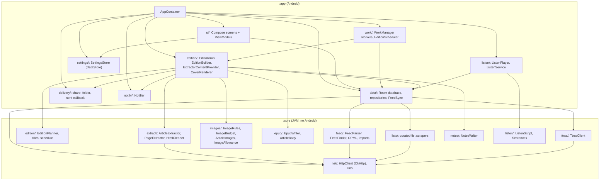
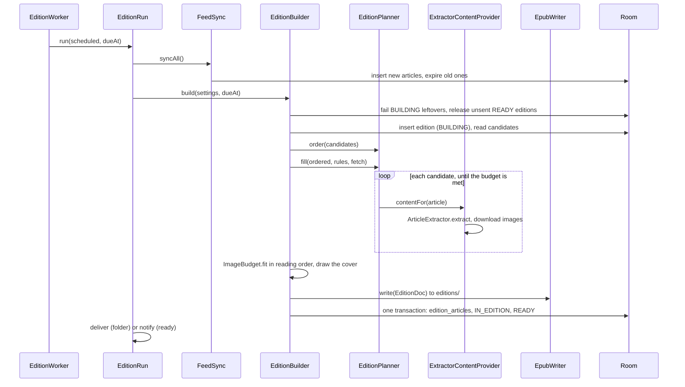
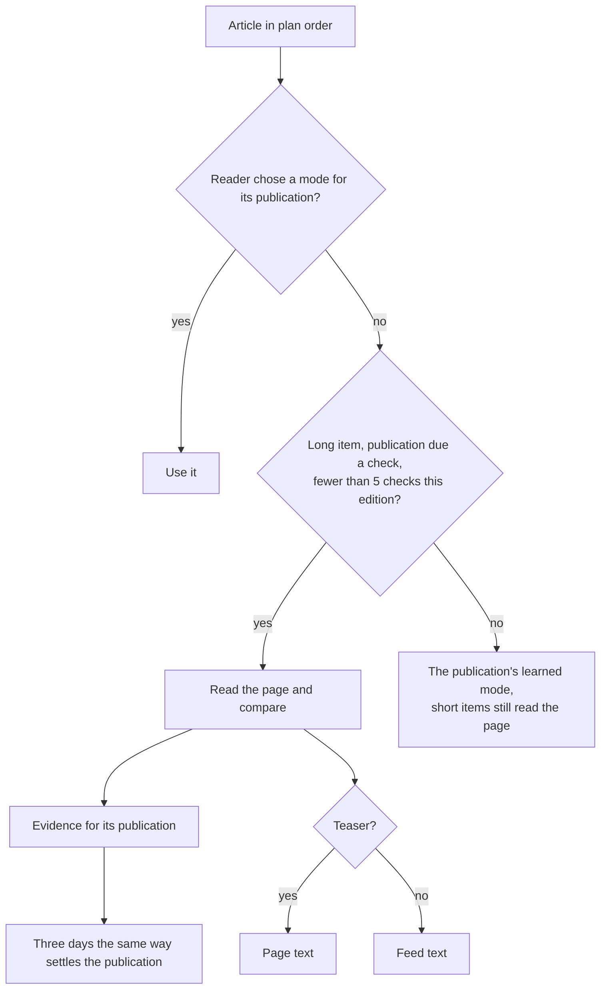
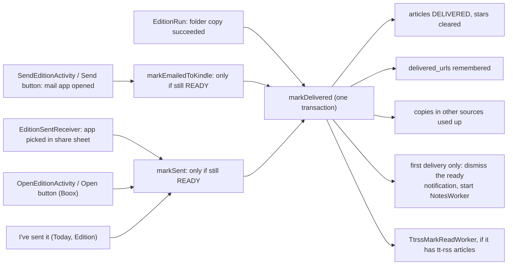
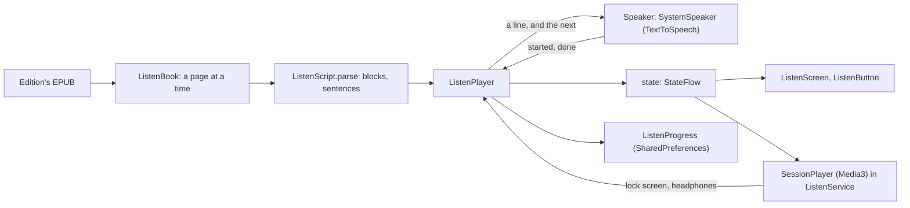
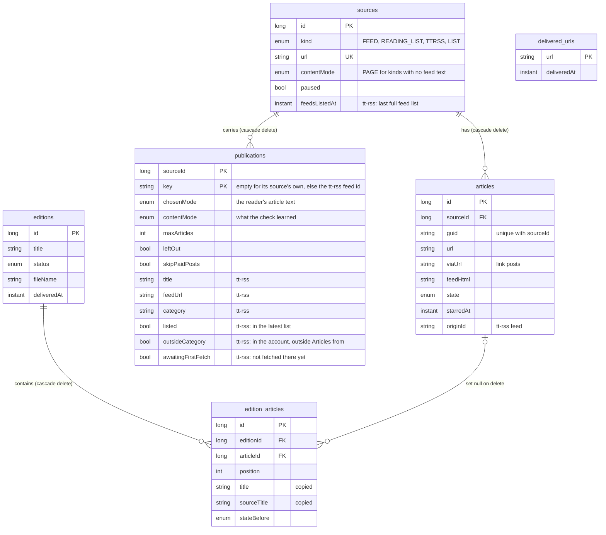
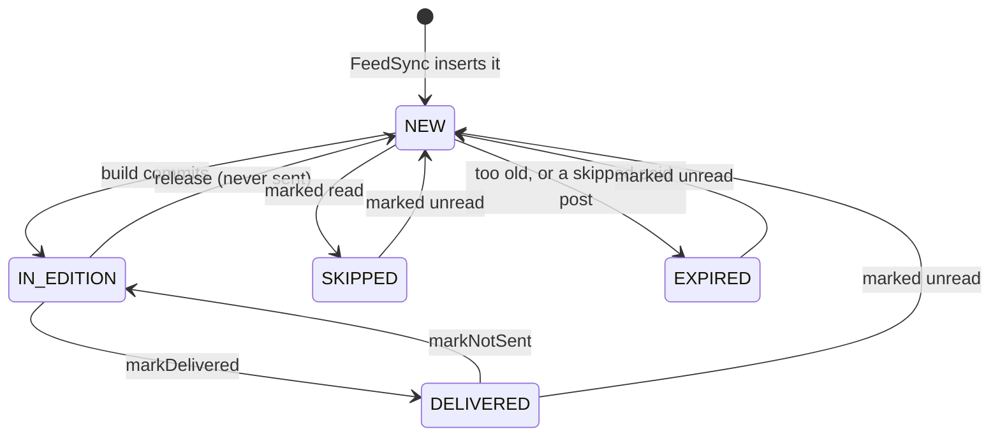

# newspaperss: architecture

How the code is built. What the app does, and why, is in
[DESIGN.md](DESIGN.md); this doc doesn't repeat the rules it describes
(how the planner picks, what counts as delivered). Paths are relative to
`app/src/main/java/com/app/newspaperss/` (`app/…`) and
`core/src/main/kotlin/com/app/newspaperss/core/` (`core/…`).

## Modules

Two Gradle modules (`settings.gradle.kts`):

- **`:core`** is plain Kotlin on the JVM. It knows nothing about Android,
  Room or WorkManager: it takes values in and gives values back, so it's
  tested with plain JUnit.
- **`:app`** is the Android app. It stores things, runs things in the
  background, draws the screens and calls into `:core`.

`:core` gets its libraries from `core/build.gradle.kts`: jsoup,
Readability4J, kotlinx.serialization and OkHttp. The two things `:core`
can't do without Android are passed in as interfaces:

- `ImageEncoder` (`core/images/ImageRules.kt`), implemented by
  `app/edition/AndroidImageEncoder.kt` with Android's bitmap decoder.
- The cover, a `(CoverInfo) -> EpubImage?` function given to
  `EditionBuilder`, drawn on an Android `Canvas` by
  `app/edition/CoverRenderer.kt`.

## Wiring

- **`AppContainer`** (`app/AppContainer.kt`) builds one of each service for
  the app's lifetime, by hand: no Hilt or Dagger. Its constructor takes the
  HTTP client, database and worker-enqueuing functions as parameters, so
  tests can swap them.
- **`NewspaperssApp`** (`app/NewspaperssApp.kt`) creates the container,
  creates the notification channels, schedules the 12-hour sync and arms
  the edition timer.
- Everything else reaches services through
  `(applicationContext as NewspaperssApp).container`: workers, receivers
  and the small activities.
- **Screens** are Jetpack Compose in one activity, `MainActivity`, with
  Navigation Compose. Each ViewModel is created with
  `viewModel { … }`, given the services it needs from the container, and
  exposes `StateFlow`s built from Room `Flow`s.

Entry points from outside the app (`app/src/main/AndroidManifest.xml`):

| Entry point | What it does |
|---|---|
| `MainActivity` | The app. |
| `ShareActivity` | Share target: saves a link to the reading list and closes. |
| `OpenEditionActivity` | The notification's **Open** (Boox): opens the EPUB and marks it sent. |
| `SendEditionActivity` | The notification's **Send** with email to a Kindle: opens the mail app and marks it sent. |
| `EditionSentReceiver` | The share sheet reports which app was picked: marks the edition sent. |
| `ClockChangeReceiver` | Time or time zone changed: re-arms the edition timer. |
| `FileProvider` | Hands EPUB and notes files to other apps by `content://` URI. |
| `ListenService` | Keeps an edition playing aloud with the screen off; Android's media controls talk to it. |

## Making an edition

One build runs in `EditionWorker` (`app/work/EditionWorker.kt`), which
calls `EditionRun.run` (`app/edition/EditionRun.kt`): sync, build, deliver,
notify.

The steps, with where they live:

1. **Sync.** `FeedSync.syncAll` (`app/data/FeedSync.kt`) fetches every
   unpaused source except the reading list, four at a time. Feeds go
   through `FeedParser`, tt-rss through `TtrssClient`, curated lists
   through `CuratedLists`; once a day a tt-rss sync also asks for the
   account's whole feed list (`listTtrssFeeds`) to name its
   publications. It then
   expires old waiting articles, forgets delivered links after a year and
   drops old feed text.
2. **Start.** `EditionBuilder.build` (`app/edition/EditionBuilder.kt`)
   marks any edition left `BUILDING` by a dead process as failed, and
   releases editions still `READY` (never sent) so their articles go back.
   It then inserts the new edition as `BUILDING` and reads the candidates
   (`ArticleDao.candidates`), dropping left-out publications' unless starred.
3. **Order.** `EditionPlanner.order` (`core/edition/EditionPlanner.kt`)
   sorts candidates: stars first, then by turns across publications: a
   feed added here is one, and each of a tt-rss account's feeds is one. A
   publication's own cap replaces the edition's.
4. **Fill.** `EditionPlanner.fill` walks that order, fetching one article
   at a time through a callback, and stops when the time budget is met.
   Fetching inside the loop is what keeps a big pool cheap: articles
   after the budget are never fetched.
5. **Extract.** `ExtractorContentProvider.contentFor`
   (`app/edition/ExtractorContentProvider.kt`) runs `ArticleExtractor`
   (`core/extract/`), then downloads the images, four at a time, drawing
   on an `ImageAllowance` so images that can't fit aren't downloaded.
   Decoding is one at a time (a mutex) to bound memory. Which text to use
   is chosen per publication (`TextChoices` in `EditionBuilder`), below.
6. **Fit and write.** Articles are put in reading order (sources in list
   order, tt-rss last as on Sources, each feed's articles together), `ImageBudget.fit` settles the final image set,
   `CoverRenderer` draws the cover, and `EpubWriter` (`core/epub/`) writes
   the book to `files/editions/`.
   An article's HTML is cleaned twice on purpose: `HtmlCleaner` when it's
   extracted, and `ArticleBody` again as the book is written, since the
   writer can't assume what it's given is safe XHTML.
7. **Commit.** One Room transaction writes `edition_articles`, sets the
   articles to `IN_EDITION` and the edition to `READY`. Until then no
   article has changed state, so a failure leaves them all for next time.
   (The one exception: a paid post its publication skips becomes
   `EXPIRED` as soon as its fetch finds it, and stays so.)
8. **Deliver.** With folder delivery, `EditionRun` copies the file
   (`FolderDelivery`, through the Storage Access Framework) and marks it
   delivered. Otherwise a timed run posts the "ready" notification.

Failures inside a build mark the edition `FAILED` with a reason the
reader can read; an exception never escapes as a crash
(`EditionBuilder.fail`, `EditionWorker.doWork`).

### Choosing an article's text

The rules are in DESIGN.md; the evidence and its arithmetic are in
`core/extract/FullTextCheck.kt`, recorded by `SourceRepository.recordFullText`.

## Delivery and what follows

Articles are only used up in `EditionRepository.markDelivered`
(`app/data/EditionRepository.kt`). Every delivery route ends there:

- **Send** is `EditionIntents.send` (`app/delivery/EditionIntents.kt`).
  Usually it's the share sheet, a chooser intent with a callback
  (`EditionSentReceiver`). The callback also grants the chosen app read
  access to the file until reboot, because Send to Kindle reads it after
  its screen closes.
- **Email to a Kindle** aims an email intent at the chosen mail app
  (`MailApps` lists them; the manifest's `<queries>` make them visible).
  With no chooser to report back, launching it is what marks the edition
  sent: the screen's ViewModel does it in the app, and from the
  notification a small activity (`SendEditionActivity`) does, since a
  receiver can't start an activity from a notification. If the app is
  gone, or none was chosen, it's the share sheet with the same email.
- **`markNotSent`** is the reverse: it puts the articles back in the
  edition, forgets the delivered links and asks tt-rss to mark them unread.
- **`KindleSends`** (`app/delivery/KindleSends.kt`) remembers recent sends
  to a Kindle, by the Kindle app or by email, in memory only, for the "can
  take a few minutes" note.

## Listening

Reading an edition aloud (`app/listen/`, `core/listen/`). The book is the
source: what's read is what the e-reader shows.

- **`ListenScript`** (`core/listen/`) reads a book page into blocks (title,
  paragraphs, quotes, list items, pictures) and splits them into lines:
  one sentence each (`Sentences`), or a picture's one-line description.
  A line is what ↶ goes back to and what the screen tints.
- **`ListenPlayer`** is the one player, in `AppContainer`, made on first
  use. It gives the voice the line being read and the next, so there's no
  gap, and moves the position when a line starts. Each line's id carries a
  generation number, bumped by every pause and jump, so a late callback
  from the voice can't move it. Pages are read from the book when they're
  reached.
- **`Speaker`** is the voice. `SystemSpeaker` wraps Android's
  `TextToSpeech`; tests use a fake. A better voice (Kokoro, in the
  backlog) would be another `Speaker`.
- **`ListenService`** is a Media3 `MediaSessionService`. Its
  `SessionPlayer` (a `SimpleBasePlayer`) shows the player's state to
  Android, an article a track, and turns the lock screen's commands into
  the player's. It also asks for audio focus and pauses when headphones
  are unplugged. The app binds it (`ListenService.connect`) when Listen is
  first tapped, and Media3 makes it a foreground service while it plays.
- **`ListenProgress`** keeps where each of the ten most recent editions
  was left, and which were heard to the end, in SharedPreferences
  (`listening`).

## Background work

All background work is WorkManager. Unique names keep work from running
twice.

| Work | Started by | Unique name, policy | Notes |
|---|---|---|---|
| `EditionWorker` | "Make an edition", the timer | `edition-build`, KEEP | One build at a time. Needs a connection. A timed run that reaches no source retries twice (5, then 10 min). |
| `EditionScheduler.Timer` | `EditionScheduler.reschedule` | `edition-schedule`, REPLACE / APPEND | One-off timer 30 min before the due time; it starts a build and arms the next timer. |
| `SyncWorker` (periodic) | App start | `sync-periodic-12h`, KEEP | Every 12 h, connected, battery not low. Only keeps the Sources screen fresh. |
| `SyncWorker` (now) | Adding a source, refresh | `sync-now`, APPEND_OR_REPLACE | Appended so a new source isn't missed by a sync already running. |
| `NotesWorker` | First delivery | `notes-<edition>`, KEEP | Saves the notes file to the notes folder. |
| `TtrssMarkReadWorker` | Delivery, mark not sent | `ttrss-mark-read-<edition>`, REPLACE | Up to 4 attempts. Reads the edition's state when it runs. |
| `ReadingListTitleWorker` | New untitled links | `reading-list-titles`, APPEND_OR_REPLACE | Batches of 20, one batch at a time. |
| `MoveFeedsWorker` | Moving phone feeds to tt-rss; app start, if a move is stored | `move-feeds`, APPEND_OR_REPLACE | Connected. Runs `FeedMoves.run`; what's left is in DataStore, so a run stopped part way carries on in the next. Appended so a run finishing up can't swallow a new move. |

Timed editions use a chain of one-off timers, not periodic work, because
periodic work can't say "6:30 on weekdays" and its start time drifts
(`app/work/EditionScheduler.kt`). The decision to keep, cancel or re-arm
a timer is pure logic in `ScheduleTimer` (`core/edition/Schedule.kt`).
The pending and last due times are kept in SharedPreferences
(`edition-schedule`).

## Data model

Room database `newspaperss.db` (`app/data/AppDatabase.kt`, entities in
`app/data/Entities.kt`, queries in `app/data/Daos.kt`). Schemas are
exported to `app/schemas/`, and each version step has a `Migration`.

- **Sources carry, publications write.** A source is how articles arrive
  (a feed address, a tt-rss account, the reading list, a curated list):
  sync, read sync, sign-in and Pause are per source. A publication is who
  wrote them, and holds the settings about the writing: article text, cap,
  left out, Skip paid posts. A feed added here and a feed in tt-rss differ
  only in which source carries them. An article's publication is
  `(sourceId, originId ?: "")` (`PublicationEntity.keyOf`).
- **A publication's row** is written only once there's something to keep;
  no row means the defaults. Every read-modify-write of one runs in a
  transaction (`SourceRepository.editPublication`, `recordFullText`,
  `setFeedInPaper`, `listTtrssFeeds`), so none drops another's fields.
- **`sources` keeps some unused columns** (`section`, `maxArticles`,
  `contentModeChosen`, the old check state): dropping a column means
  rebuilding the table, and with foreign keys on that would delete every
  article.

- **`delivered_urls`** stands alone, with no foreign key, so a delivered
  link is remembered even after its source is removed.
- **`edition_articles`** copies the title and source name, so an
  edition's contents survive its source being removed.
- **A star** is the `starredAt` column, not a state.

An article's `state` moves like this (the queries are in `ArticleDao`):

A starred `DELIVERED`, `SKIPPED` or `EXPIRED` article is a candidate too,
so it can go straight to `IN_EDITION`; if that edition is never sent, it
returns to the state saved in `edition_articles.stateBefore`.

An edition's `status` is `BUILDING`, then `READY` or `FAILED` (with
nothing new, the row is deleted instead); `READY`
becomes `DELIVERED` (or `FAILED` when a newer build releases it), and
`DELIVERED` goes back to `READY` when marked not sent. A deleted edition
stays as a `DELETED` row to keep its title taken.

## Other storage

| What | Where | Code |
|---|---|---|
| Settings | DataStore (Preferences) | `app/settings/SettingsStore.kt` |
| tt-rss account | Its own DataStore; the password encrypted with an Android Keystore AES-GCM key, excluded from backups | `app/data/TtrssAccountStore.kt`, `app/data/SecretCipher.kt` |
| A move of phone feeds to tt-rss, and moved feeds still kept | Its own DataStore, `feed_moves` | `app/data/FeedMoves.kt` |
| Timer state | SharedPreferences `edition-schedule` | `app/work/EditionScheduler.kt` |
| Where listening stopped | SharedPreferences `listening` | `app/listen/ListenProgress.kt` |
| EPUBs | `files/editions/`; only the newest 14 keep their file (unsent ones always do) | `EditionRepository.pruneFiles` |
| Notes files | `files/notes/` | `app/edition/EditionNotes.kt` |
| HTTP cache | `cache/http`, used to revalidate feeds | `AppContainer`, `core/net/HttpClient.kt` |

Auto Backup leaves out the EPUBs, the timer state and the tt-rss account
(`app/src/main/res/xml/backup_rules.xml`).

**Where the feeds come from** is the setting `feedsFrom` (`PHONE` or
`SERVER`), never guessed after it's set. It's unset only until the app's
first start after the upgrade that added it: `AppContainer.settleFeedsFrom`
sets it to `SERVER` if a tt-rss source exists, else `PHONE`; until then
screens read it the same way (`Settings.feedsFrom(hasServer)`). `SERVER`
with no working account (no tt-rss source, or a password the phone can't
read, e.g. after a restore) is a state of its own, `TtrssStatus`, which
Sources and Settings show as "Sign in to your tt-rss". Sources reads the
setup too: with `SERVER` it shows the account only as a banner when it has
a problem, then the reading list, the phone feeds still to move, the
account's feeds by `publications.category`, and curated lists; with
`PHONE` nothing of tt-rss. Its rows, the tt-rss part and the sign-in state load as one
value (`SourcesViewModel.screen`), so nothing lands above rows already
shown. The once-a-day feed list (`listTtrssFeeds`, in `FeedSync.kt`) marks feeds in the
chosen category `listed` and, with a category chosen, asks for the rest
and marks them `outsideCategory`: that's "Not in your paper". Both flags
are cleared and redrawn together, and ignored while `feedsListedAt` is
null after the category changes. Leaving the server
is `TtrssRepository.signOut`: the login and the tt-rss source go, and with
it, by cascade, its articles.

**Adding a site with a server** subscribes in tt-rss rather than adding a
phone feed. The phone finds the feed (`FeedFinder`), `TtrssRepository.feedAt`
checks the account's listed feeds with `sameFeed`, and
`TtrssRepository.subscribe` calls `TtrssClient.subscribeToFeed`, then lists
the feeds at once (`listTtrssFeeds`, outside the daily gate, which keeps
`feedsListedAt` set), so the row shows and Undo has the feed id even from
a tt-rss too old to return it. tt-rss downloads the feed before it answers,
so `TtrssSubscriptions` runs the request in the container's `appScope`:
closing the dialog or leaving Sources doesn't cancel it, and the outcome
waits in its `results` until Sources shows it, in the dialog if it's still
open on that feed, else as a snackbar. A worker would survive the process
dying, but an answer it got couldn't reach an open dialog or offer Undo;
a subscribe cut off that way is in tt-rss anyway, and the next daily list
shows it. The list after subscribing runs only if the same login is still
signed in, and from a tt-rss that doesn't return the id, Undo's id is a
feed new since the subscribe. Undo (`TtrssRepository.unsubscribe`, for
that login only) unsubscribes, leaves the feed out and expires its waiting
articles (a sync may have brought some, or still be bringing them), and
lists again. A snackbar waits while an Add dialog is open, so its Undo
can be reached. A feed tt-rss hasn't fetched yet (`last_updated` 0) is
`awaitingFirstFetch` until a sync sees unread articles from it or the
next list. The last category used is the setting `lastCategoryId`.

**Moving phone feeds to tt-rss** (`FeedMoves`, run by `MoveFeedsWorker`;
the sheet and banner are `PhoneFeedMover` in `ui/sources/MoveFeeds.kt`).
`start` stores the batch in its DataStore: the source ids still to ask
about, the category, the login signed in, and the account's feed keys as
listed then. `run` takes the queue in Sources' order. A feed `feedAt`
finds (by `sameFeed`) isn't subscribed again; any other goes through
`TtrssRepository.subscribeForMove`, whose "already subscribed" (code 0)
counts as there too. Each answer is stored before the next feed, so a run
stopped by the app dying or WorkManager's time limit picks up after the
last answer; the feed it was asking about is asked again, which tt-rss
answers with code 0. A different login, or none, stops the rest; so does
tt-rss not answering. Once the queue is empty the feeds are listed once
(`listFor`, only under the same login), and each moved feed's tt-rss
publication is found (`movedFeedAt`: the id tt-rss gave; on old servers
the feed new since the batch began, at that address, never one listed
before). The settings are copied from `(phoneSourceId, "")` onto
`(ttrssId, feedId)` and the phone source paused in one transaction; the
fields `listTtrssFeeds` owns (title, address, category, the list flags)
are left to it.

**Retiring a moved phone feed:** deleting a source cascades to its
articles, starred ones too, so a moved feed is paused and kept in
`FeedMoves`' `retiring` set instead, which Sources hides (only while it's
paused: resumed from its page it's a phone feed again). `EditionBuilder`
takes `retiring` sources' articles though they're paused, so stars and
waiting articles still reach the paper. `FeedMoves.tidy`, after each
periodic sync and each move, deletes them with `SourceDao.deleteSpent`,
one statement that checks nothing starred, waiting or `IN_EDITION` is
left, and nothing in an edition delivered in the last 14 days, which Mark
as not sent could give back with its stars. Delivered links are in
`delivered_urls`, and at the move the feed's links the reader marked read
are added there too (`ArticleDao.rememberRead`), so tt-rss's copies of
neither go in the paper. Leaving the server, or signing in as another
user (`FeedMoves.restore`), unpauses the ones still kept and drops a move
under way. A worker that keeps failing (three tries) gives what's left
back to the banner (`FeedMoves.giveUp`).

## Doing things safely at the same time

- **One build at a time:** the build's unique work name with KEEP.
- **No changes under a build:** unstarring and marking read are refused in
  SQL while an edition is `BUILDING` (`ArticleDao.unstar`,
  `markReadAll`); starring is still allowed.
- **Re-check inside transactions:** `markDelivered` and
  `releaseUndelivered` re-read the edition's status inside their
  transaction, since a send and a build can race.
- **Timer changes are serialized** by a mutex in `EditionScheduler`.
- **Cancellation:** a stopped build marks its edition `FAILED` in
  `NonCancellable` before rethrowing.
- **Short-lived callers hand off:** receivers use `goAsync()` and the
  container's `appScope`, and work that may be slow (notes to a cloud
  folder, tt-rss) goes to a worker. Subscribing in tt-rss is the
  exception, in `appScope`, since its answer goes back to the screen.
- **One move at a time:** `FeedMoves.start` refuses a batch while one is
  stored, checked inside the DataStore edit, and each step of a batch
  writes only if its batch is still the stored one.
- **One subscribe per feed at a time:** `TtrssSubscriptions` won't ask
  tt-rss about a feed it's already asking about, so a double tap sends one
  request.

## Tests and CI

- `:core`: plain JUnit, `./gradlew :core:test`.
- `:app`: Robolectric and Compose UI tests against a real Room database,
  plus `MigrationTest` for schema steps.
- CI (`.github/workflows/build-and-test.yml`) runs `./gradlew build` and
  Kover's 90% line-coverage check, then publishes the debug APK.
- A daily job (`.github/workflows/live-check.yml`) reads each curated
  list's live page, so a site redesign shows up before it reaches a phone.
